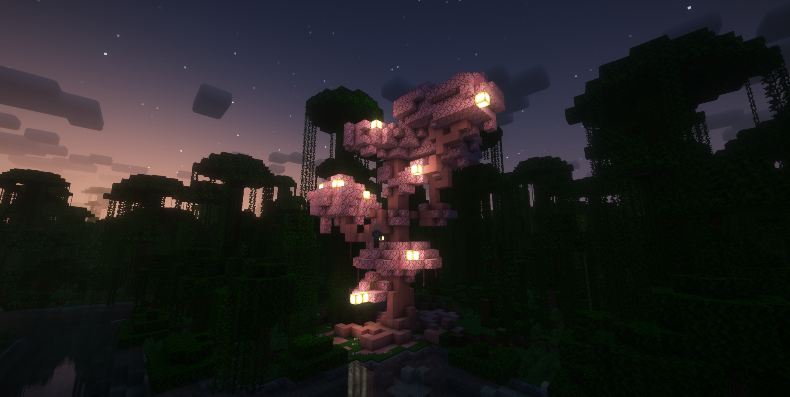
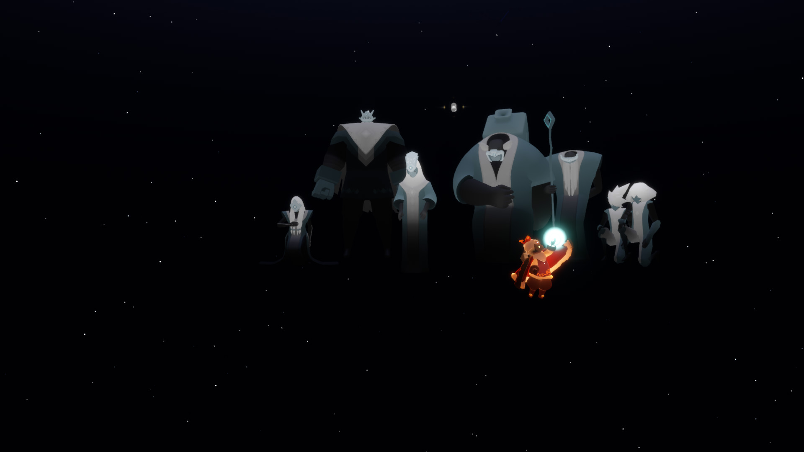

其實越長大，以前的遊戲就越少打開來玩了
從新手什麼都不懂，到後來已經熟悉所有東西了
那種新奇的感覺就消失了
## Minecraft
以前Minecraft可是我超愛的遊戲，每天放學就跟同學約幾點上線一起玩Hypixel
後來還去報名營隊，直接變成指令大師

但是漸漸地就不太玩了，明明線上上課的時候還很喜歡

後來偶然遇到一個伺服器邀請我用資料包製作遊戲，重新開啟我對Minecraft的熱情
我想，要回去一個可以自由創造的世界，還是需要一點小活動才可以

## 光遇
想起來，光遇真的是很治癒的遊戲
每一個地方都超美，會考那時候每天都在考複習卷，心情都不太好，但是晚上打開光遇就感覺被治癒了

中間也認識了很多人，感覺光遇讓緣分這件事具象化了，不管現在有沒有聯絡，我都很珍惜那時候的相處

後來也是慢慢就退出了
最近好像要出新季節了，我看看要不要回坑吧

---
其實這些遊戲我不是厭倦了，只是需要一段很長的休息
然後就會重新開始一段很長的旅程

