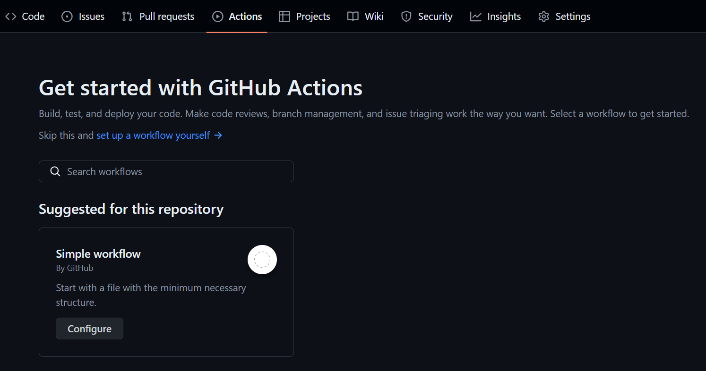

前幾天正在製作Github的個人檔案，想弄酷一點，偶然接觸了Github Action
由於個人檔案的README.md是一個repo，所以其實可以透過這個方式來動態更新
Action可以自動化執行終端指令，所以只要設定抓取資料再寫上去就好了

我以抓取氣象局的天氣簡述為例，利用Python執行抓取資料並編輯檔案後Commit
本筆記只提供特定目標做法，不解釋整個Action原理

本篇筆記比較複雜難寫，有問題或錯誤歡迎留言
成品在這
<!-- head -->
<script src="https://tarptaeya.github.io/repo-card/repo-card.js"></script>

<!-- NEW: for dark theme just set data-theme attribute -->
<div class="repo-card" data-repo="shark-speare/Taiwan-Weather" data-theme="dark-theme"></div>

# 前置設定
* 請先準備好Github token，並在該repo新增一個secret，名為`TOKEN`
* 請先準備好需要使用的API與Python程式碼，確認其可抓取資料後變更同資料夾內的README.md，並上傳到repo
* API的Token也可新增至secret內
* 前往repo >> Settings >> 側邊欄Actions >> General >> Workflow permissions，切換成Read and write permissions

# 新增Action

進入儲存庫的Action，新增一個Simple Workflow
上面的blank.yml可以自己改名稱

# 編輯設定
最近常常看到yaml檔案，不知不覺也學起來了
你應該會進入一個編輯檔案的畫面
將最前端的資訊改成這樣
```yaml
name: Weather Report

on:
  schedule:
    - cron: '0/5 * * * *'
```
我省略了註解的部分，供參考
* name是這個工作流的名字，預設是CI，隨便你取
* on是工作流的觸發條件，預設是推送的時候會觸發部署，但是我們需要定時的天氣預報，所以改成用schedule
* 觸發間隔使用cron表達式(自行搜尋)，但注意第一個參數從分鐘開始(最快每5分鐘)，且**使用UTC時區**

## 設定Python
往下看應該會看到一串工作流程
更改為以下這樣:
```yaml
jobs:
  weather:
    runs-on: ubuntu-latest

    steps:
      - uses: actions/checkout@v4

      - name: Set up Python
        uses: actions/setup-python@v5.1.1

      - name: edit
        run: |
          python main.py
        env: 
          WEATHER: ${{ secrets.(你的secret名稱) }}
```
* job包含一系列的步驟，一個工作流可包含多個job，可以建立執行條件，比如前一個job成功後才執行下一個。
* 設定了這個job叫做weather，使用最新版本的ubuntu來運行

steps包含一個一個終端指令，有時候是Action的操作，如安裝Python:
  ```  yaml    
  - name: Set up Python
    uses: actions/setup-python@v5.1.1`
  ```

或是終端指令:
如果要運行很多行，可以移到下一行開始，原本的run後面加上那個直的符號 `|` (我不知道那叫什麼)
```yaml
- name: Edit
  run: |
    python main.py
```

## Python程式碼
  ```yaml
- name: Edit
  run: |
    python main.py
```
main.py將從repo裡面引用
可自行準備，只要能夠成功更改README.md即可
以下是我的範例:
```python
import requests
import os

# 設定API參數，同時使用環境變數隱藏資訊
params = {
'Authorization' : os.environ['weather'],
'format' : 'JSON'
}

# 取得資料
result = requests.get('https://opendata.cwa.gov.tw/fileapi/v1/opendataapi/F-C0032-009',params=params).json()

# 資料內有三項描述，用for迴圈將其統整在一個列表
description = [result['cwaopendata']['dataset']['parameterSet']['parameter'][i]['parameterValue'] for i in range(3)]

# 製作成一個字串
write = '\n'.join(description)

# 開啟檔案並加上標題# 臺北市天氣 ⛅後寫入
with open('README.md',mode='w',encoding='utf8') as f:

    f.write(f'# 臺北市天氣 ⛅\n{write}')
```

可以如下程式碼，利用env來將repo內的秘密作為環境變數使用，python中可使用os.environ來使用
```yaml
- name: edit
  run: |
    python main.py
  env:
    WEATHER: ${{ secrets.(你的secret名稱) }}
```
## 送出變更
與剛剛的其他步驟同一縮排:
```yaml
- name: commit and push
  run: |
    git config --global user.email 'jack04309487@gmail.com'
    git config --global user.name 'shark-speare'
    git add README.md
    git commit -m "update README.md"
    git push
```
# 流程統整
1. `actions/checkout@v4`引入repo內檔案
2. `actions/setup-python@v5.1.1`安裝python
3. 執行檔案變更
4. 送出變更到repo

# 執行
完成後送出變更並回到Action，點擊剛剛的Workflow然後Run Workflow
再回去看看檔案是否有變更

小提醒，如果檔案前後沒有動的話，會出現錯誤，但是不須擔心，可點進每一個工作流事件看看出錯原因
