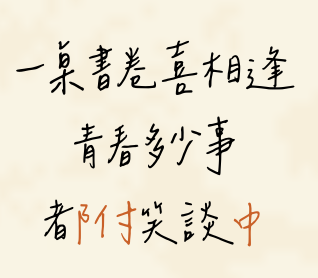

# 畢業紀念冊

一桌書卷喜相逢 
青春多少事 
都付笑談中

我曾經擔任班上的畢業紀念冊編輯(是不久前的高中)，當時我在畢冊裡面塞了一首我構思的短句。
如果有一點文學素養的話應該會覺得這個句構蠻熟悉的。其實這就是

《臨江仙·滾滾長江東逝水》 
滾滾長江東逝水，浪花淘盡英雄。 
是非成敗轉頭空。 
青山依舊在，幾度夕陽紅。 
白髮漁樵江渚上，慣看秋月春風。 

一壺濁酒喜相逢。 
古今多少事，都付笑談中。

其中我化用了後三句，改成「一桌書卷喜相逢」和「青春多少事」。

其實我一開始選這篇時沒有想到，這裡藏了個小巧思。我就讀的是師大附中，簡稱附中。 
順便宣傳一下一個附中原則，只有師大附中才能叫「附中」

在最後一句「都付笑談中」裡面其實藏了一個附中，而我後來才發現竟然有這種巧合。於是我也把這個小巧思在畢冊裡面標出來了。有趣的是，Canva不支援把文字轉成透明圖檔再拆開，或是幫文字的部件分別填色，所以實際上這個效果是先把「都付」兩個字設定成紅色之後，拿純色方塊把「都」的「者」遮起來，再另外打一個黑色的「者」。

# 無人知道的小詩作

薰風盛放花千樹。更吹過、歲如梭。書卷筆硯伴學途。朗書聲動，粉字落散，幾朝課室入。 
藍天午後雷陣雨，鳳凰浴火高飛去。眾裏尋它千百度，驀然回首，青春就在生命綻放處。

另外我也自己又改寫了一首詞，是辛棄疾的《青玉案·元夕》，附上原文：

《青玉案·元夕》 
東風夜放花千樹。更吹落、星如雨。寶馬雕車香滿路。鳳簫聲動，玉壺光轉，一夜魚龍舞。 
蛾兒雪柳黃金縷。笑語盈盈暗香去。衆裏尋他千百度。驀然回首，那人卻在，燈火闌珊處。

我盡量符合了原作的詞性，為此我思考了很久。上闕其實比較早完成，當時有靈感就一下寫出來了，難的其實是下闕。

首先，蛾兒雪柳黃金縷的難處在於這是三個名詞連用塑造的情境，我必須要找到三個名詞能夠跟附中或是畢業有關係。我一開始的構思是**科目**，比如說 物理化學家政課，單擺苯環餅乾去(?) ，但一聽就超爛的，而且我不覺得有哪三個科目可以代表我們在附中生活的全部，我有一種想要整體美感的偏執。

想了很久之後想到學校的代表動物以及稱號「藍天之子」，所以採用了這兩種元素。不過笑語盈盈暗香去的疊字就沒有保留了，因為我覺得浴火更好一點。

再來是最後一句，我很早就想到我要說青春就在...處了，不過找到恰當的四字名+動真的很困難，其實最終版我也不是非常滿意，不過是我能想到最好的用法了。期間我還有徵詢過別人意見，有人說什麼青春就在學測斷崖處。其實我不太記得確切的用詞了，不過當時他的文句就是這個意思。他的用詞更高級一點，如果放進來確實不會違和，不過我想要充滿希望的感覺，所以還是回絕掉了(◐‿◑)

這則小作品我沒有跟任何人提起過。其實班導是國文老師，好像可以讓他評論一下。不過我完成之時已經是畢業幾天後了，在謝師宴上我也沒有拿出來。現在想想其實當時應該拿出來問問他的想法的。