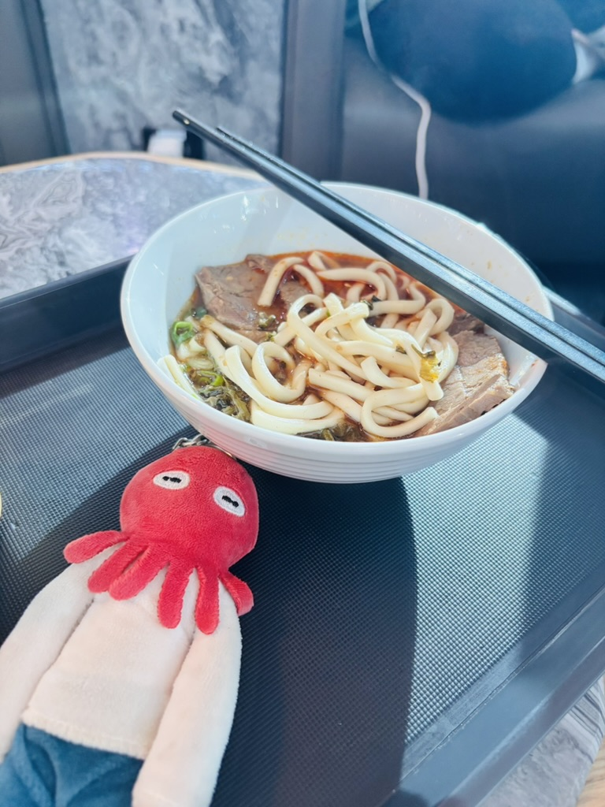
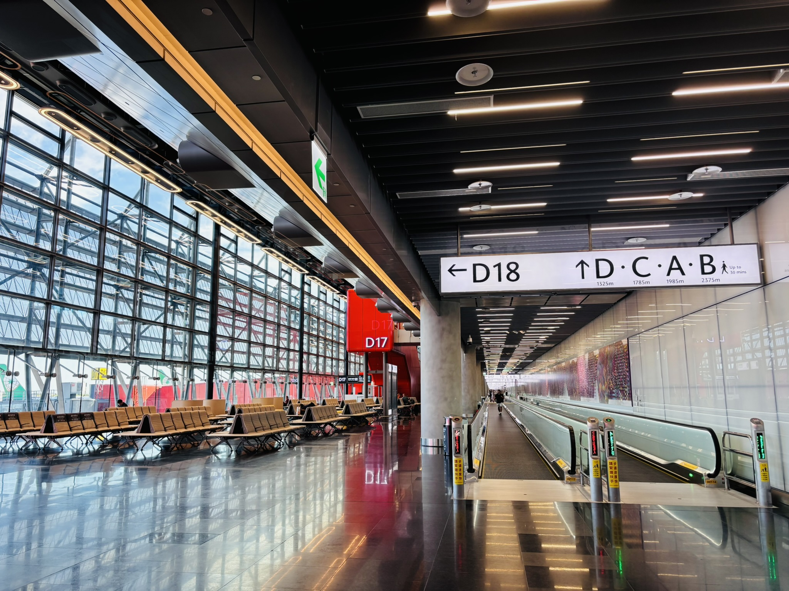
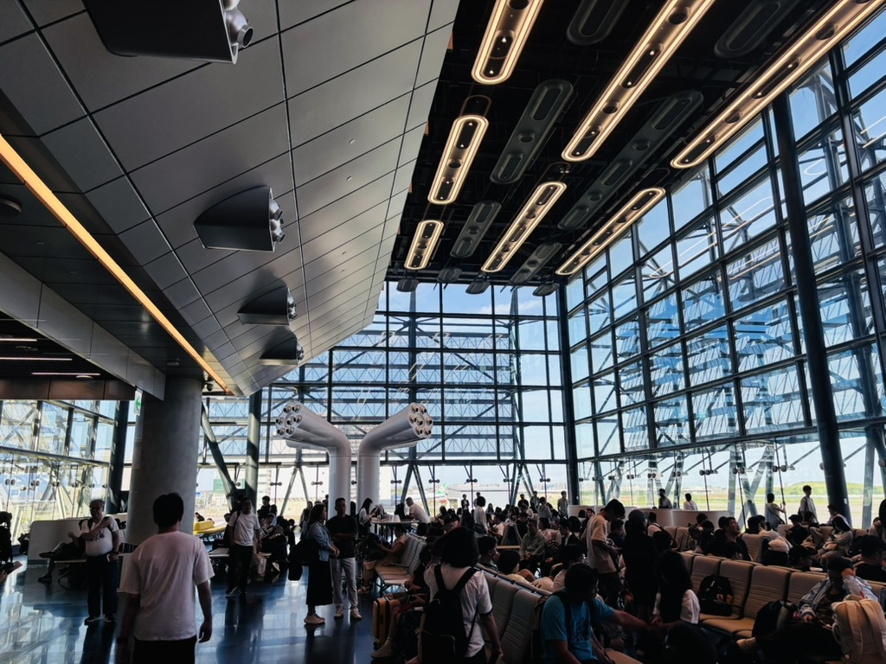
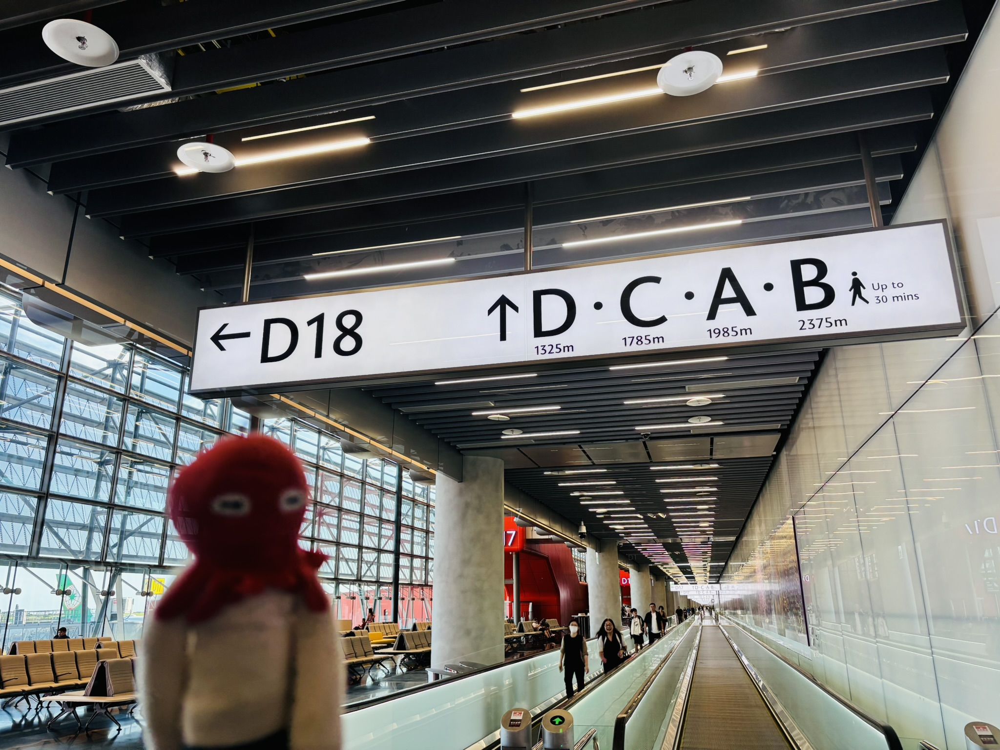
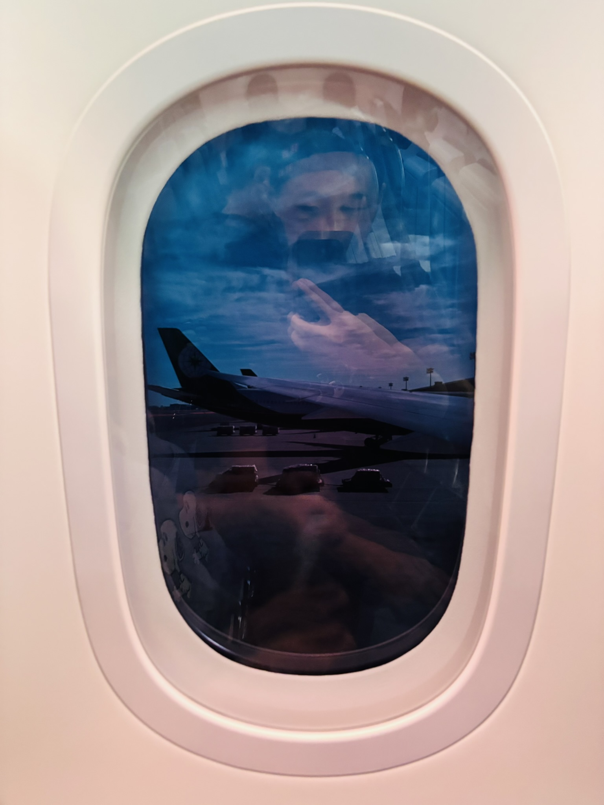
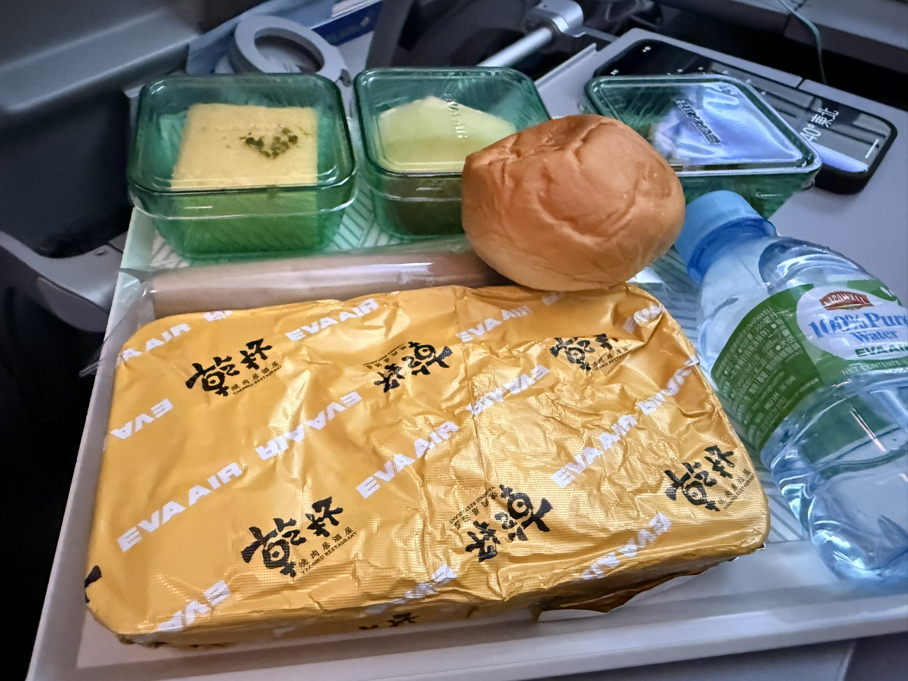
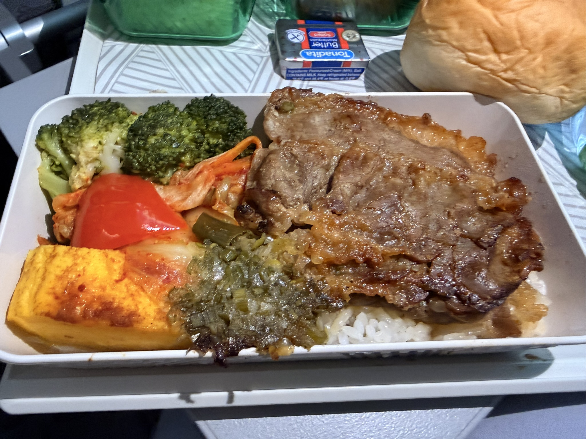

今天早上4點就起床了，因為機場接送專車4\:50就到樓下。前一天晚上原是打算早點入眠的，結果仍是興奮到睡不著。回想起來小學、中學時的校外教學前或是畢旅前也是差不多的，打算早睡早起結果變晚睡早起。這次行程主要是圍繞東京附近遊玩，順便去遠一點的橫濱和鎌倉，而且是全自由行，只靠地鐵和雙腳走遍東京。

# 機場
早上抵達松山機場，行李托運、入關後就前往貴賓室吃點早餐，因為媽媽持有銀行貴賓會員，所以跟上次出國一樣又蹭了一次貴賓室。貴賓室有提供小碗的台式沙茶牛肉麵，還是一樣好吃。

    

我們的登機門在D18，是整個登機口走廊最底端，所以還沒吃到爽就要先出發了。大概提前半個小時從貴賓室離開了，結果走著走著發現真的超級遠的，直接在路上狂奔到登機口

    

    
    登機門在超長的走廊底端
    

    

    
    這邊已經是末端的大落地窗了
    

    

    
    

    
# 飛機上

起飛前發現這次乘坐的機種窗戶很不一樣，是長榮的波音787，是利用電流改變窗戶內的材質，讓顏色變深藍或透明達到遮光效果。
以前乘坐的飛機都是單純遮光板，只有全遮或全開。但這種設計可以調整亮度，而且最暗的亮度仍然可以看到外面，不用為了亮度犧牲風景。

飛機上的餐點難得有和乾杯聯名的牛肉燒肉，直接拿下。醬汁蠻好吃的，而且肉給的算很多。不過我吃過的乾杯都是跟超商聯名的商品，還有這次的飛機餐，都還沒真正吃過乾杯本店的食物。
不曉得在哪裡的課文或是英文雜誌聽過，高空會使人的味覺靈敏度降低，所以飛機上的食物會做得重口味一點。

    

    
    

    

    
    

