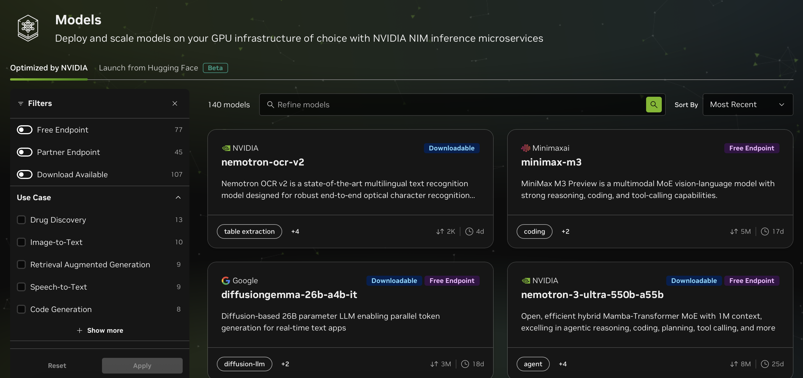
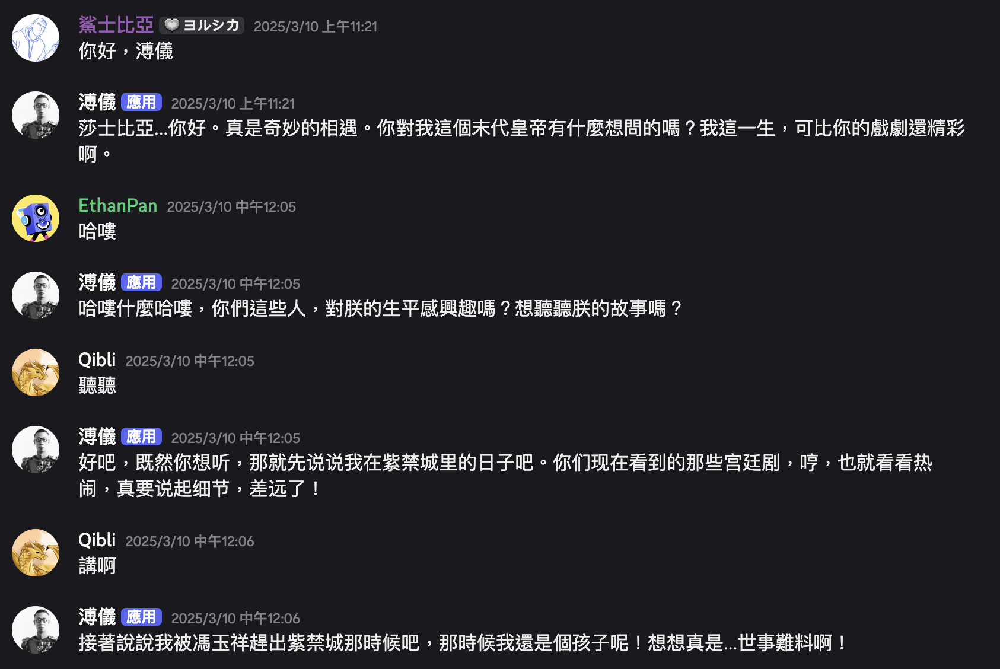

今天看學弟妹籌備營隊的時候，有人說課程可以教Nvidia API。我就點進去看了一下，Nvidia 竟然有提供一堆模型的免費接口，而且有些可以自己 Download 下來跑。

我很久以前是用 Gemini 2.5，不過後來他開始限制免費的上限我就沒有用了。當時是拿來在社團的群組內串機器人，做一些有趣的功能，比如說跟古人對話，那時候玩得超瘋。我當時就是把前面20句丟給他，然後每個禮拜改 prompt 讓不同人來，總共玩了曹操、不知名的皇帝、希特勒*2、溥儀、耶穌。

現在想起來我那時候用 Discord 機器人經營社團的群組蠻成功的。我的上一屆(我當社員的那一屆)群組很冷清，沒什麼人講話。我當上幹部以後群組歸我管，我就整天塞一些奇怪的功能到機器人裡面讓大家玩，比如說 akinator、數字接龍、看天氣之類的。社團的點名也是我用機器人做的，上一屆是用 Google 表單填寫當天在白板上的關鍵字，然後再手動對比。我後來就用機器人收集回應，自動對比名單產出當日未到的人，這套系統現在我的下一屆還在用呢。

我其實一直有想要做一個類似管理行程的助理，用自然語言提要求之後，讓他轉成 JSON 格式，我再用各種方法塞到行事曆裡面。有了這個 API，感覺也不是什麼難事了，有時間就來做做看。