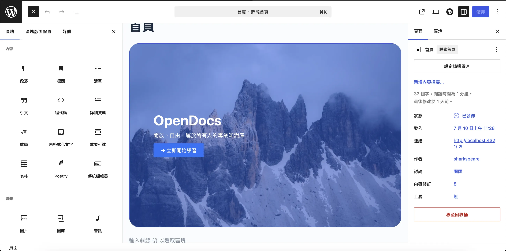

最近在脆上面刷到有人想要做一個開源的知識庫，給大家投搞，他的原文是這樣的

<blockquote>
我想做一個有點像是github的網站，然後放一些開源的教學文件（跟mooc不一樣，是pdf或是md之類的，就是會想要讓大家教學知識的行為能夠更簡易達成之類的） 每個人都可以上去寫
</blockquote>

加入他的群組之後，我們就開始討論這個東西該怎麼做。

我一開始是想到Github搭配Astro，因為這個部落格就是這樣架設的。用Github的開源協作特性來達成開放知識庫的特點，想要投稿只要開一個fork寫自己的文章然後做PR就好了，推完會自動部署超方便。而且因為是開放給大眾的，不要讓大家寫太多html/css/java，所以用這種可以解析md成靜態網站的工具更方便。

群組內有人說他自架wordpress好幾年了，我就去看了看他的網站。老實說我覺得超醜的，側邊欄全部都是根據月份的歸檔連結，排了一整串，分類被擠到最下面。然後他的自我介紹也寫得很詩意，好雖然是好，但是我一點進去這個網站並不會知道有什麼東西可以看，就是被一坨我不知道在寫什麼的文章砸臉而已。總之我提了一些建議給他，還好他也沒有不高興，說我講的不錯。

主揪後來又陸陸續續提供了一些想法，統整起來大約是：

* 首頁熱門文章推薦
* 搜尋功能
* 依照課程分類，並附帶固定格式
  * 課程介紹
  * 先備知識
  * 上次更新時間
  * 開始閱讀按鈕
  * 討論區
* 類似Notion的區塊編輯器
* 有管理員內容審核

然後他自己用Notion搓了一個雛形，不過真的蠻簡陋的，而且我覺得用Notion做到有權限分別的CMS還是有點困難。這種等級的成品感覺已經是可以給別人接案的等級了，我覺得很難有人要免費幫忙弄這些。

不過這也引起了我的另一個想法。我之前在[部落格史](../../../posts/關於我/我的部落格史)說過，我曾經使用Wordpress架設部落格。現在想想Wordpress的特性是不是正好可以做到這件事，因為他的外掛真的超級多的，感覺就是有一個外掛可以做到課程管理這種東西。

於是我找回了我的老友InfinityFree，沒想到他現在真的還提供免費的主機，不過速度有點慢就是了。我本來是打算拿來展示用，正式上線再換好的主機。不過剛回來wp還需要探索一下，到處切來切去的時候真的等太久了，我索性改成本地自架開發，做完再丟上去。

捏雛形的過程中也探索了一下最新的編輯器和外觀外掛。

1. Stackable外掛蠻好用的，是為原生編輯器加上很多好用的方塊，不過暫時還用不上
2. Elementor一如既往的吝嗇，一堆超基本的Block都要付錢
3. 原生Gutenburg真的是越來越好用了，而且跟很多外掛都融合得很好，不需要另外使用專用編輯器

    

總之最後是把課程系統建立起來了，也弄了個簡單的首頁。但課程外掛是全英文的，所以也裝了人工插件翻譯，等分科完就來搞一波。