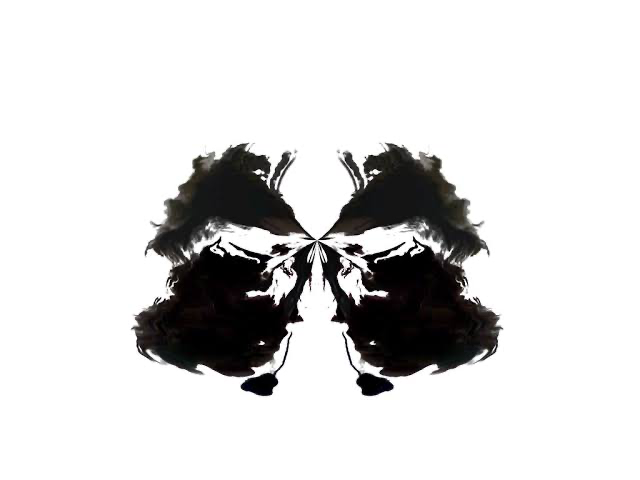

最近在讀《獻給阿爾吉儂的花束》，裡面提到了「羅沙哈測驗」，台灣多翻羅夏克測驗。還有提到關於心理測驗受試者對於心理學書籍攝取的限制，我覺得蠻有趣的。

羅沙哈測驗由幾張有墨漬的卡片組成，其中5張是白底黑墨水，2張是白底及黑色或紅色的墨水，另外3張則是彩色的。受試者會被要求回答他們最初認為卡片看起來像什麼及後來覺得像什麼。心理學家再根據他們的回答及統計數據判斷受試者的人格還有狀態。

為了不劇透太多，簡單透露一點點劇情就好。主角在一個會經常接受心理測驗的期間，被限制看心理學相關的書籍，因為施測者跟他說，如果看了心理學的書籍會在受測時思考心理學理論，而不是自己的想法和感覺。

這件事其實蠻有趣的，如果我先知道了心理測驗的結果分析邏輯，那麼我做出來的結果是否會有所不同？

比如說MBTI（我知道這不算一個正式的心理測驗，但概念是類似的）。我知道MBTI的四個象限邏輯，所以我可以輕易看出每個問題正在判斷哪一個象限的哪一方。那人們是否會因此先主觀判斷自身結果，然後朝著判斷的方向，或是理想的自己作答呢？

比如說E和I代表恢復精神的方式是社交/獨處，而我想要成為一個外向善於社交的人，我也盡量說服自己我跟別人出去玩是在休息。那麼我是否會因此選擇偏向E的答案，即使我知道獨處才是我休息的方法？ 

上述這個例子有些太過明確了，我不可能在測驗時一直想著我要選E的選項。現實中通常這種想法是更不容易自我察覺的，因為這是可以拿出去宣揚的自我分類，我多少會希望這能夠符合我對自己的預期，所以會判斷選項是否符合我對自己的看法。這樣就變得先入為主了，我是依照對自己的理解和期許而作答，而不是得到結果後才更了解自己。

所以關於MBTI這種自我分析的測驗，分析過程變得廣為人知也許不是一件好事。不過誰說這樣不好呢，現在的MBTI早已成為一種社交標籤而不是真實自我了，只要我盡力表現出那種人格的樣子，在別人看來那又有什麼區別呢？