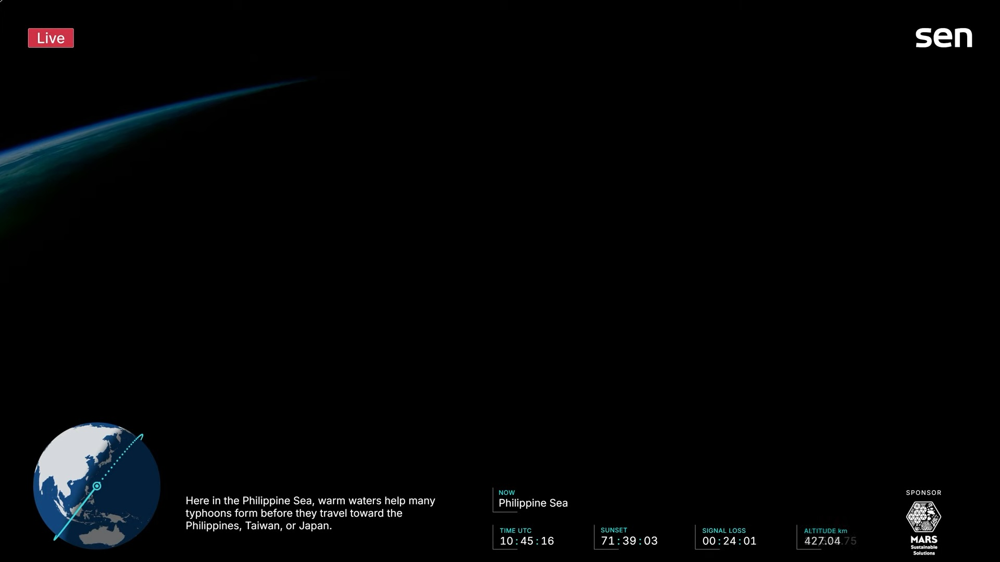

這週六就是分科了，結果剛好遇到巴威來攪局，寫作的當下剛剛宣布延期，但不知道是延到禮拜一或禮拜二。讀書休息無事時，打開了Youtube的衛星直播看看地球上空。

這是我看的直播 -> 

突然覺得沒事來看看地球長什麼樣子也很不錯。只是打開的時候已經接近傍晚了，經過台灣右側太平洋時已經是漆黑一片，

這顆衛星每90分鐘繞地球一圈，所以一天大概可以看到16次日出日落。不過我覺得很有趣的是，他每間隔一段時間(大約半小時)，會有幾分鐘丟失訊號，而且這個時間完全可以預測。其實是因為現在的衛星雖然是用NASA的TDRSS(Tracking and Data Relay Satellite System)中繼，不過仍有幾個地方是訊號死角完全收不到，比如說赤道上空或是極區。而因為衛星幾乎是靠純力學運行的，所以這個時間完全可以算出來，畫面上才會出現一個 SIGNAL LOSS 的計時器。