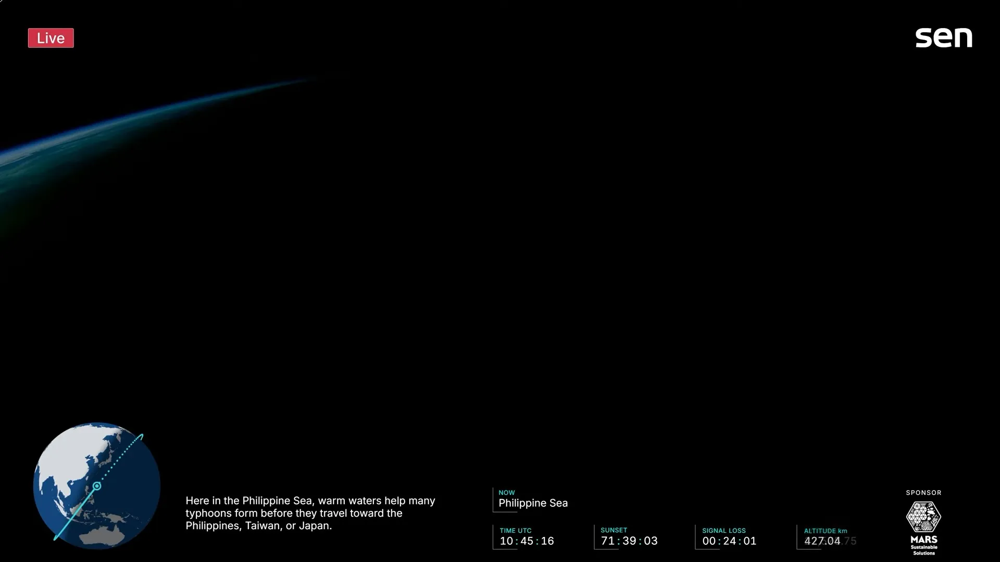
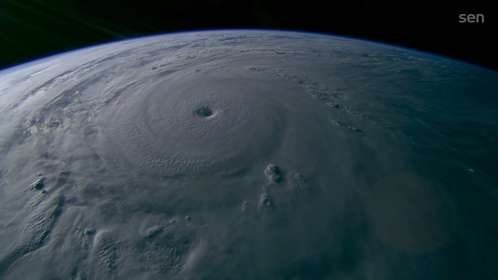
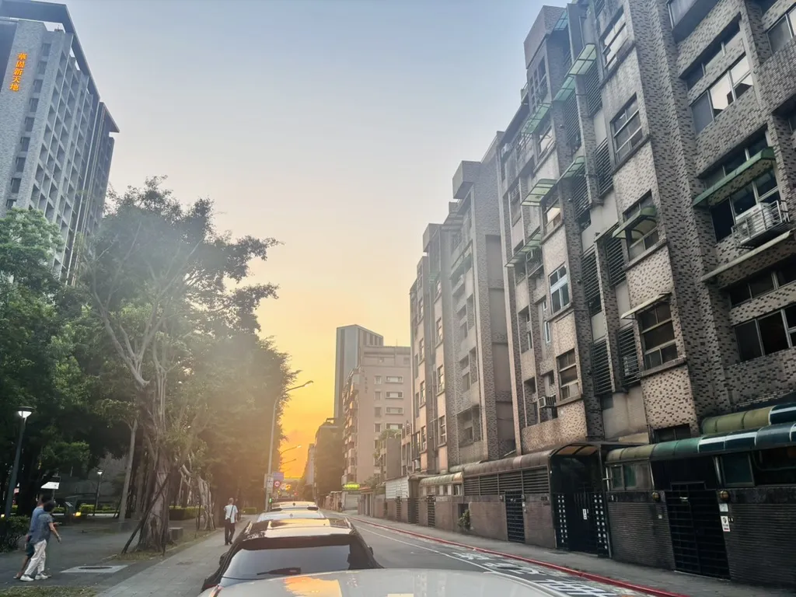

這週六就是分科了，結果剛好遇到巴威來攪局，寫作的當下剛剛宣布延期，但不知道是延到禮拜一或禮拜二。讀書休息無事時，打開了Youtube的衛星直播看看地球上空。

這是我看的直播 -> [Live 4K video of Earth and space: 24/7 Livestream of Earth by Sen’s 4K video cameras on the ISS
](https://www.youtube.com/watch?v=fO9e9jnhYK8)

突然覺得沒事來看看地球長什麼樣子也很不錯。只是打開的時候已經接近傍晚了，經過台灣右側太平洋時已經是漆黑一片，畫面上剛好介紹到菲律賓海的暖海水會幫助颱風形成，可能會往菲律賓、台灣、日本的方向移動。

    

        
        7/7 18\:45截圖
    

    

        
        兩天前經過巴威的上空[直播留檔](https://www.sen.com/video/1575a4e8-bc08-4592-84b7-915f3c1846fc)
    

這顆衛星每90分鐘繞地球一圈，所以一天大概可以看到16次日出日落。不過我覺得很有趣的是，他每間隔一段時間(大約半小時)，會有幾分鐘丟失訊號。其實是因為現在的衛星雖然是用NASA的TDRSS(Tracking and Data Relay Satellite System)中繼，不過仍有幾個地方是訊號死角完全收不到，比如說赤道上空或是極區。而因為衛星幾乎是靠純力學運行的，所以這個時間可以算出來，畫面上才會出現一個 SIGNAL LOSS 的計時器。

今天下午還是好天氣呢，至少從巴威出現到現在一直都是好天氣，不曉得什麼時候會開始狂風暴雨

---

隔天早上起來看了直播，點進去的時候不在台灣，所以嘗試往前找紀錄。結果發現過去6個小時都在斷線狀態，下方的計時器跑了兩秒又往上加兩秒，一直卡在2\:20左右。問了聊天室説是國際太空站合作夥伴有未經排程的臨時維護，所以還要一段時間。不過他同時也說由於軌道排程的關係，就算有訊號也看不到颱風了，只好再等等。